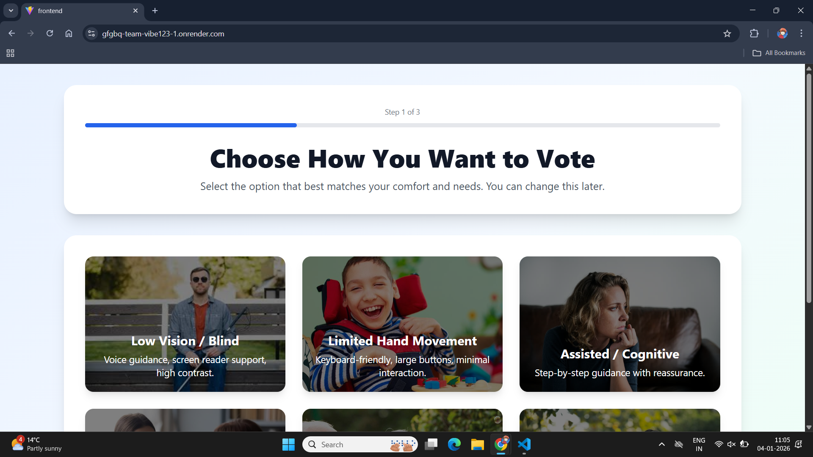
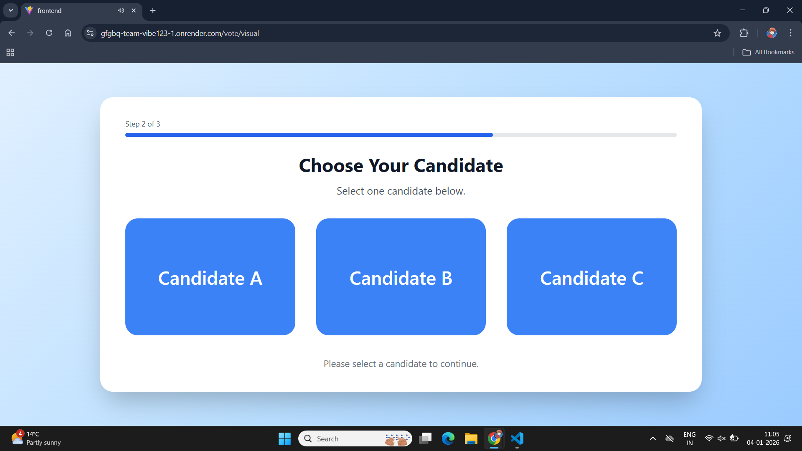
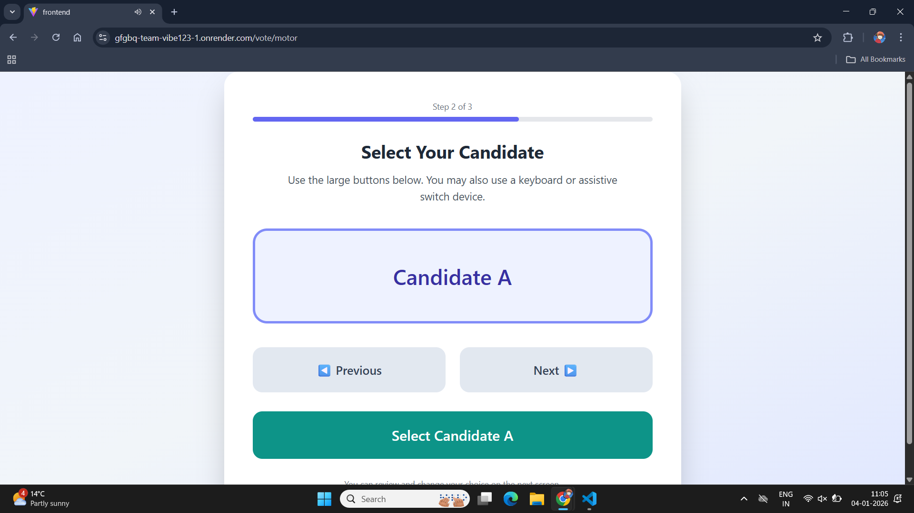
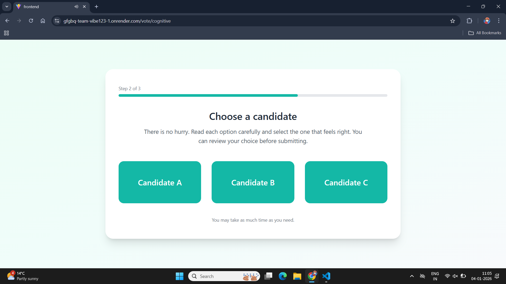
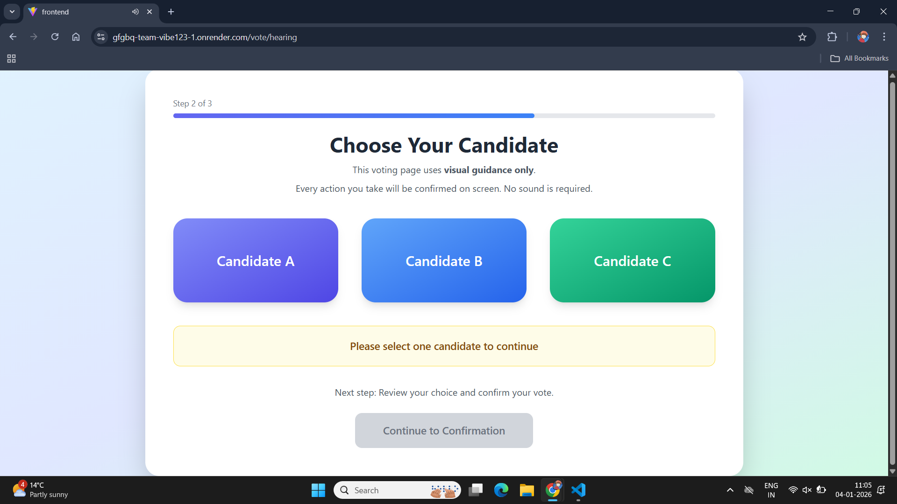
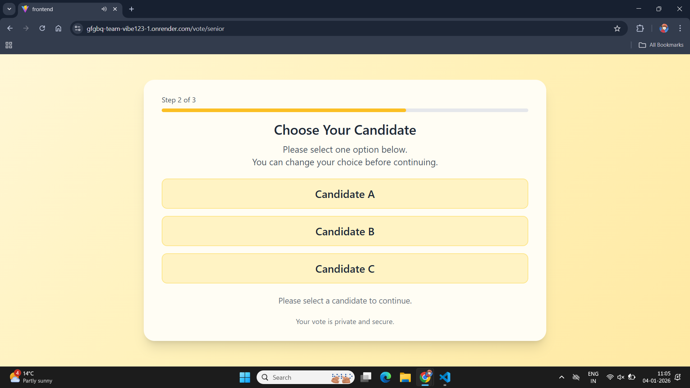
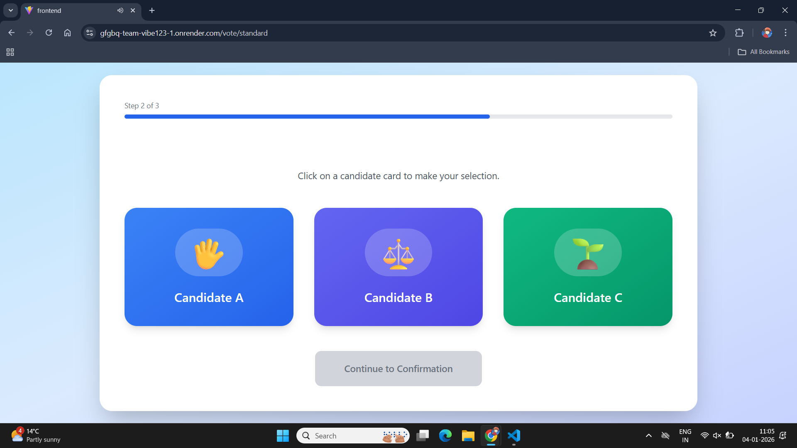
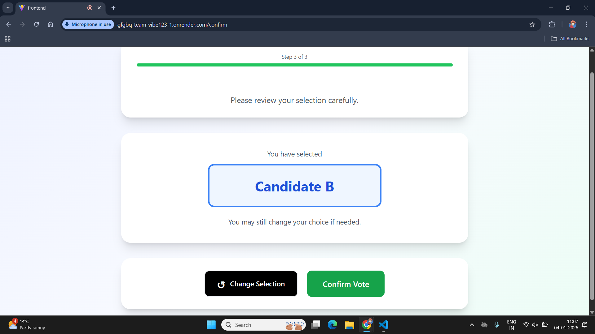
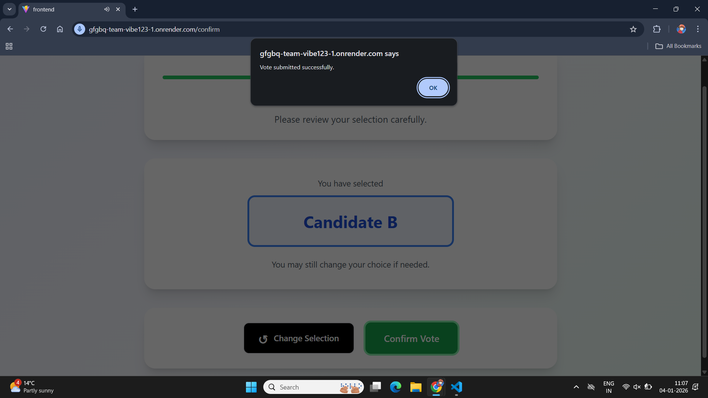

# 📌 Problem Statement

**Inclusive and Accessible Digital Voting System**

Traditional digital voting systems often fail to accommodate voters with disabilities, elderly users, and first-time voters. The goal of this project is to design and implement a secure, inclusive, and accessible voting platform that adapts its interface and interaction methods based on individual user needs, ensuring equal participation for all citizens.

---

# 🗳️ Project Name

**VoteAble**

---

# 👥 Team Name

**Team Vibe123**

---

# 🌐 Deployed Link

🔗 **https://gfgbq-team-vibe123-1.onrender.com**

> The complete system—including frontend UI and backend API—is deployed on Render, enabling a fully functional, end-to-end accessible voting experience directly from the browser. 


---

# 🎥 2-minute Demonstration Video

_To be added_

---

# 📊 PPT Link

https://drive.google.com/drive/folders/1d4CNxLION120w1Y6WOTwVF2pTIvH9wNA?usp=sharing

---

## 🚀 Project Overview

**VoteAble** is an accessibility-first digital voting platform designed to ensure that every citizen—regardless of physical, sensory, or cognitive ability—can vote independently and confidently.

Instead of a single rigid interface, the system dynamically adapts the voting experience based on the user's selected accessibility mode.

---

## ♿ Accessibility Modes Implemented

### 1️⃣ Low Vision / Blind Voters
- Screen reader friendly UI  
- Voice guidance using Speech Synthesis  
- Voice commands using Speech Recognition  
- Click-anywhere interaction support  

### 2️⃣ Senior Citizens
- Large text and buttons  
- Calm color palette  
- Single-page layout (no scrolling)  
- Clear confirmations  

### 3️⃣ Cognitive / Assisted Mode
- Step-by-step reassurance  
- Minimal choices per screen  
- Simple language  
- Reduced visual clutter  

### 4️⃣ Hearing or Speech Difficulty
- Visual-only instructions  
- No audio dependency  
- Strong visual confirmations  

### 5️⃣ Limited Hand Movement (Motor)
- Keyboard-friendly navigation  
- Large selectable cards  
- Minimal interaction required  

### 6️⃣ Standard Voting
- Clean and modern UI  
- Optional accessibility tools  
- Fast and intuitive voting flow  

---

## 🧭 Voting Flow

1. **Step 1:** Select Accessibility Mode  
2. **Step 2:** Choose Candidate  
3. **Step 3:** Confirm Vote (Voice or Button)  

Each step clearly indicates progress and allows users to change their selection if needed.

---

## 🛠️ Tech Stack

### Frontend
- React (Vite)  
- React Router  
- Tailwind CSS  
- Web Speech API (Speech Synthesis & Recognition)  

### Backend
- Node.js  
- Express.js  
- MongoDB Atlas  
- Mongoose  

---

## ⚙️ Setup & Installation

### 🔹 Clone Repository
```bash
git clone <repository-url>
cd GFGBQ-Team-vibe123

```

Frontend Setup

```bash
cd frontend
npm install
npm run dev
```

Frontend runs on:

https://gfgbq-team-vibe123-1.onrender.com

🔹 Backend Setup

```bash
cd backend
npm install
npm run dev
```

Backend runs on:

 https://gfgbq-team-vibe123.onrender.com

🔹 Environment Variables (Backend)

Create a .env file inside backend/:

```bash
PORT=5000
MONGO_URI=mongodb+srv://<username>:<password>@cluster0.mongodb.net/voteable
```
📡 API Endpoints

Submit Vote

```bash
POST /api/vote
```
Request Body

```bash
{
  "candidate": "Candidate B"
}
```

Response

```bash
{
  "success": true,
  "message": "Vote recorded successfully"
}
```
🔐 Security & Privacy

--No personal voter data is collected

--Votes are stored anonymously

--MongoDB Atlas used for secure storage

--No authentication required (hackathon demo scope)

📷 Screenshots

### Accessibility Mode Selection


### Low Vision / Blind Voting Mode


### Limited Hand Movement Voting Mode


### Cognitive / Assisted Voting Mode


### Hearing/Speech Voting Mode


### Senior Citizen Voting Mode


### Standard Voting Mode


### Voting Confirmation


### Vote is Confirmed


